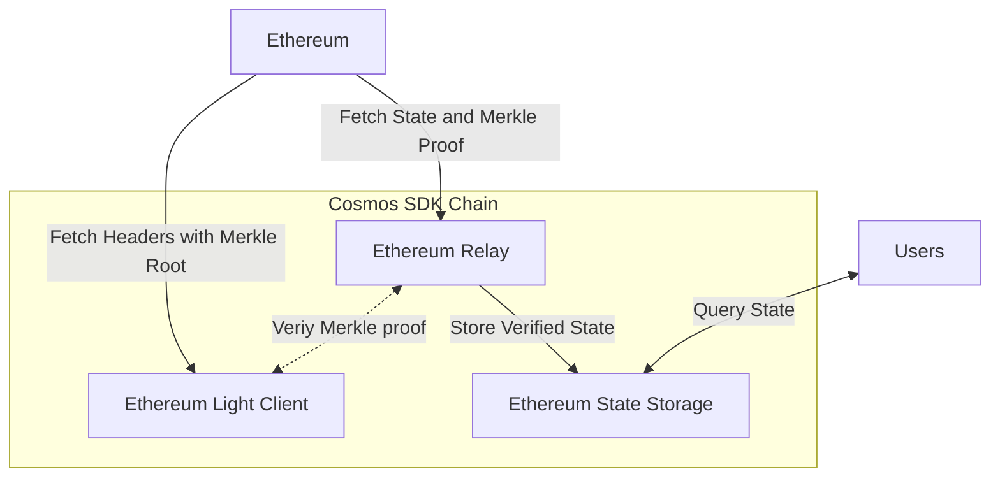
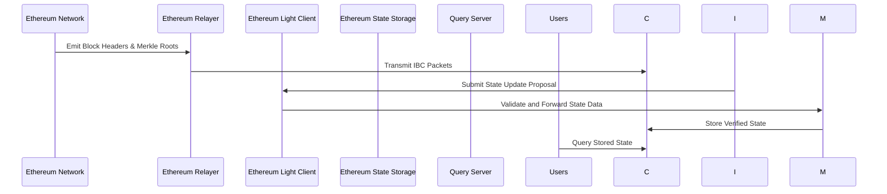

# Cosmos SDK  for Storing and Retrieving Ethereum State

A prototype blockchain that can read state from Ethereum, verify its validity, and store it on the chain.

NB: A **"state"** here is a value stored in a specific storage slot of a specific Ethereum smart contract.

## Proposed Architecture

The solution consists of following components:

1. **Ethereum Light Client.**
    - _Objective:_ proving the value of a specific storage slot at a given block in a trustless manner.
    - _Responsibilities._
        - Fetching block headers (and the embedded Merkle roots) from Ethereum consensus client.
        - Receiving state update proposals (and the embedded Merkle proof) from the **Ethereum Relay**.
        - Verifying Merkle proofs.
        - Sending verified data to **Ethereum State Storage** for storage.
    - _Prototype simplification:_ an extremely robust external Ethereum Light
      Client ([helios](https://github.com/a16z/helios)) is used currently running as a separate process on the same
      machine. It is queried by the application via JSON-RPC block's Merkle root (`transactionsRoot`)
      with `eth_getBlockByNumber`.
2. **Ethereum Relay.**
    - _Objective:_ submitting Ethereum state update proposals to the Cosmos SDK Chain.
    - _Responsibilities._
        - Fetching the required state from Ethereum execution client and a Merkle proof (`eth_getProof`).
        - Verify the Merkle proof against the Ethereum Light Client Module.
        - Submitting state update proposal to the Ethereum State Storage Module containing:
            - address,
            - storage slot,
            - block number, and
            - the Merkle proof.
3. **Ethereum State Storage.**
    - _Objective:_ storing and retrieving Ethereum state data.
    - _Responsibilities._
        - Receiving state update proposal from the Ethereum Relay Module.
        - Stores state.
        - Retrieves state on user request (Query Service Interface update).





## Usage

Copy `.env.example` to `.env` and set the environment variables.
The below example is for the geth node running locally.
NB! Erigon and Reth consequently don't support `eth_getProof`, use Geth.

```shell
ETH_RPC_URL=http://host.docker.internal:8545
```

NB! Infura doesn't support `eth_getProof` method which is used to get block's root to verify the storage slot against,
so the `ETH_RPC_URL` should be set to Alchemy, Quicknode, or your own `geth` node.

```shell
docker-compose up
```

Example query (slot 0 of Uniswap V3 WETH/USDC pair)

```shell
curl -X POST --data '{
    "jsonrpc":"2.0",
    "method":"eth_getStorageAt",
    "params": ["0x88e6a0c2ddd26feeb64f039a2c41296fcb3f5640", "0x0", "latest"],
    "id":1
}' -H "Content-Type: application/json" http://localhost:8545
```

User queries are available via the `query` command:

As a part of the genesis the App is quering slot 0x0 of the Uniswap V3 WETH/USDC pair, which can be changed with
sending `eth_input` message:
e.g.

```shell
 etherlinkd tx etherlink create-eth-input --from cosmos1nqyfmkfnr207zq35uvu88kgshkgvn79pe2x84m 0x88e6a0c2ddd26feeb64f039a2c41296fcb3f5640 0x0000000000000000000000000000000000001
```

```shell

Set address and slot to watch in Ethereum with `eth_input`
Get the current value of the slot with `eth_state`
```shell
```

## Key Design Decisions

- **The Light Client** is the choice to perform trustless validation of the fetched Ethereum state without storing the
  entire Ethereum blockchain. Alternatives could be using a trusted oracle to provide the Ethereum state, but that
  reduces the trustlessness of the system and significantly reduces security opening the system to central point of
  failure.
- **Tendermint Consensus** is built-in secure BFT consensus algorithm used here to provide agreement on the Ethereum
  state being stored. All validators in the Cosmos chain will receive the state update proposal. They will each
  independently verify the proof against their own copy of the light client, and vote on whether the state update is
  valid. If 2/3 of validators agree on the update, it is added to the chain.
- **Ethereum query** The `eth_getProof` method is preferred over `eth_getStorageAt` because it not only returns the same
  value but also provides a Merkle proof. This proof is used to validate the authenticity of the returned value against
  the light client.
- **Merkle Patricia Trie verification** was written to verify the Merkle proof against the State root. 

## Future Improvements

- The current system is extremely simplified, and implemented as a single Cosmos App. The modular design is anticipated
  in the initial component breakdown, and each component is expected to be implemented as a separate Cosmos SDK Module.
  Moving the logic into modules will allow for easier maintenance and upgrades.
- Ethereum Light Client as a Cosmos SDK Module. Separate reusable solution going forward that is in great demand among
  Cosmos SDK developers. Reusing Geth code (GPL) would be a great option since it supports the light mode natively.
- Ethereum State Storage as a Cosmos SDK Module.
- IBC Relayer is a great option for a cross-chain communication method for the purpose of submitting state update
  proposals to the Cosmos SDK Chain instead of Ethereum Relay Module.
- Currently Ethereum Node is queried directly at the beginning of every block, the better design would be listening to
  the blocks concurrently.
- Synchronize queries to the Ethereum to avoid invalid inconsistent state updates due to the timely fetching process.
- Security checks, at first long-range, replay, or man-in-the-middle attacks on the IBC Relayer, and then on the
  Ethereum Light Client Module.
- Failover and redundancy: implement automated recovery from failures.
- Test the system with a large number of nodes, a terraform or similar script to be developed to deploy the system, as
  well as a load testing tool.