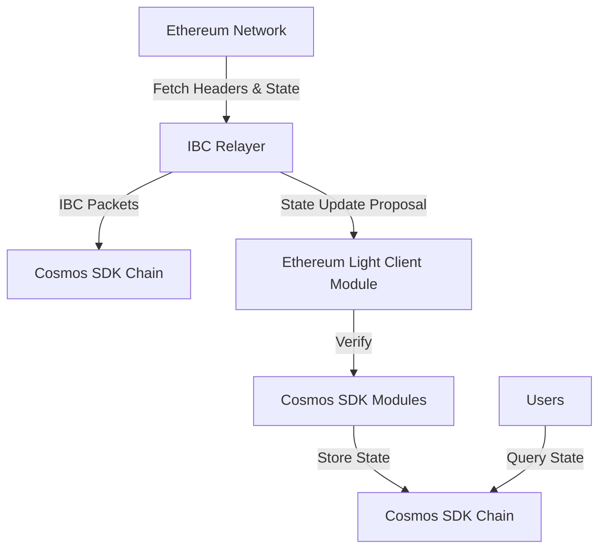
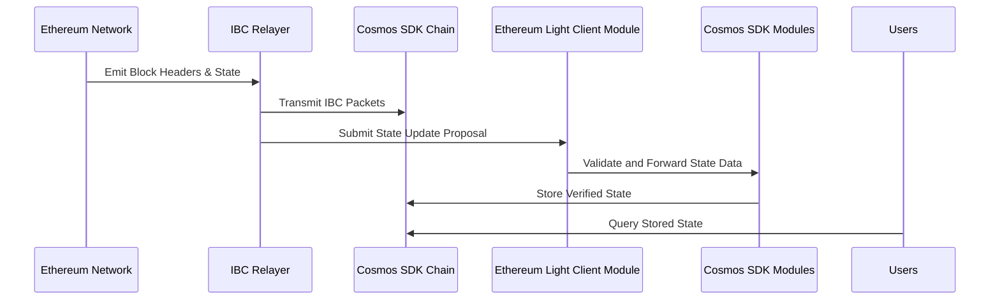

```mermaid
graph TD;
A[Ethereum Network] -->|Fetch Headers & State| B[IBC Relayer]
B --> |IBC Packets| C[Cosmos SDK Chain]
B --> |State Update Proposal| D[Ethereum Light Client Module]
D --> |Verify| E[Cosmos SDK Modules]
E --> |Store State| F[Cosmos SDK Chain]
G[Users] -->|Query State| F

```

```mermaid
sequenceDiagram
    participant E as Ethereum Network
    participant I as IBC Relayer
    participant C as Cosmos SDK Chain
    participant L as Ethereum Light Client Module
    participant M as Cosmos SDK Modules
    participant U as Users
    
    E->>I: Emit Block Headers & State
    I->>C: Transmit IBC Packets
    I->>L: Submit State Update Proposal
    L->>M: Validate and Forward State Data
    M->>C: Store Verified State
    U->>C: Query Stored State

```