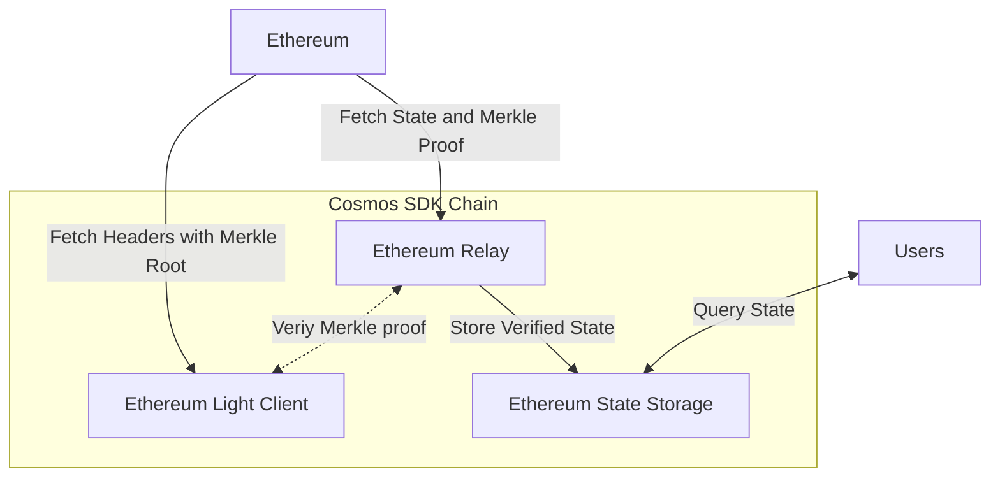

# Cosmos SDK  for Storing and Retrieving Ethereum State

A prototype blockchain that can read state from Ethereum, verify its validity, and store it on the chain.

NB: A **"state"** here is a value stored in a specific storage slot of a specific Ethereum smart contract.

## Proposed Architecture

The prototype solution consists of following components:

1. **Ethereum Light Client.**
    - _Objective:_ proving the value of a specific storage slot at a given block in a trustless manner.
    - _Responsibilities._
        - Fetching block headers (and the embedded Merkle roots) from Ethereum consensus client.
        - Receiving state update proposals (and the embedded Merkle proof) from the **Ethereum Relay**.
        - Verifying Merkle proofs.
        - Sending verified data to **Ethereum State Storage** for storage.
    - _Prototype simplification:_ an extremely robust external Ethereum Light
      This is not used currently for simplicity, a full node is quiried for the same info, although a light client is a
      part of this repo and it is possible to run ([helios](https://github.com/a16z/helios)) as a separate process on
      the same
      machine in a docker container.
2. **Ethereum Relay.**
    - _Objective:_ submitting Ethereum state update proposals to the Cosmos SDK Chain.
    - _Responsibilities._
        - Fetching the required state from Ethereum execution client and a Merkle proof (`eth_getProof`).
        - Verify the Merkle proof against the Ethereum Light Client Module.
        - Submitting state update proposal to the Ethereum State Storage Module containing:
            - address,
            - storage slot,
            - block number, and
            - the Merkle proof.
3. **Ethereum State Storage.**
    - _Objective:_ storing and retrieving Ethereum state data.
    - _Responsibilities._
        - Receiving state update proposal from the Ethereum Relay Module.
        - Stores state.
        - Retrieves state on user request (Query Service Interface update).



## Quick Start
[Go 1.19+](https://go.dev/dl/) and [Ignite CLI](https://docs.ignite.com/welcome/install) are required.
Point the `ETH_RPC_URL` in `.env` file to your Ethereum node.
If you are running **Geth** locally, you can keep the default value.
NB! Nodes should support `eth_getProof`, which excludes Erigon and Reth at least, Infura doesn't support it either.

```shell
ignite chain serve
```

Detailed log and error messages happening during Merkle proof verification and Ethereum connectivity issues can be found in the log.
For troubleshooting use
```shell
ignite chain build
etherlinkd start
```

## Configuration

As a part of the genesis, by default the App queries slot 0x00 from the Uniswap V3 WETH/USDC pair, which
is `0x88e6a0c2ddd26feeb64f039a2c41296fcb3f5640`.
From should be the user that's running the node - Alice or Bob - use the keys displayed on node startup with `ignite chain serve`.

Then change the params by sending the tx:

```shell
 etherlinkd tx etherlink create-eth-input --from cosmos1nqyfmkfnr207zq35uvu88kgshkgvn79pe2x84m 0x88e6a0c2ddd26feeb64f039a2c41296fcb3f5640 0x0000000000000000000000000000000000001
```

Check if they are set correctly:

```shell
curl -X GET "http://0.0.0.0:1317/etherlink/etherlink/eth_input" -H  "accept: application/json";
```

## Test

Get the current value of the slot with `eth_state` query:

```shell
curl -X GET "http://0.0.0.0:1317/etherlink/etherlink/eth_state" -H  "accept: application/json";
```

or

```shell
etherlinkd query etherlink show-eth-state
```

`eth_state` goes last, the chain saves some additional info to verify it as well - `eth_merkle_root`
and `eth_merkle_proof`.

Check if the value is the same with your favirite Ethereum client:

```shell
curl -X POST --data '{
    "jsonrpc":"2.0",
    "method":"eth_getStorageAt",
    "params": ["0x88e6a0c2ddd26feeb64f039a2c41296fcb3f5640", "0x0", "latest"],
    "id":1
}' -H "Content-Type: application/json" http://localhost:8545
```

## Key Design Decisions

- **Merkle Patricia Trie verification** is the choice to perform trustless validation of the fetched Ethereum state
  without storing the entire Ethereum blockchain. Alternatives could be using a trusted oracle to provide the Ethereum
  state, but that
  reduces the trustlessness of the system and significantly reduces security opening the system to central point of
  failure.
- **Tendermint Consensus** is built-in secure BFT consensus algorithm used here to provide agreement on the Ethereum
  state being stored. All validators in the Cosmos chain will receive the state update proposal. They will each
  independently verify the proof against their own copy of the light client, and vote on whether the state update is
  valid. If 2/3 of validators agree on the update, it is added to the chain.
- **Ethereum query** The `eth_getProof` method is preferred over `eth_getStorageAt` because it not only returns the same
  value but also provides a Merkle proof. This proof is used to validate the authenticity of the returned value against
  the light client.
- A simple Ethereum **JSON RPC** client was written so support queries to the Ethereum node.

## Future Improvements

- The current system is **extremely** simplified, and implemented as a single Cosmos App. The modular design is
  anticipated
  in the initial component breakdown, and each component is expected to be implemented as a separate Cosmos SDK Module.
  Moving the logic into modules will allow for easier maintenance and upgrades.
- Error Handling done right. Fallback nodes, retries, and timeouts.
- Ethereum Light Client as a Cosmos SDK Module. Separate reusable solution going forward that is in great demand among
  Cosmos SDK developers. Reusing Geth code (GPL) would be a great option since it supports the light mode natively.
- Ethereum State Storage as a Cosmos SDK Module. There's already a very robust [helios](https://github.com/a16z/helios)
  client is part of a docker container in this repository, although it is removed for simplicity.
- IBC Relayer is a great option for a cross-chain communication method for the purpose of submitting state update
  proposals to the Cosmos SDK Chain instead of Ethereum Relay Module.
- Currently Ethereum Node is queried directly at the beginning of every block, the better design would be listening to
  the blocks concurrently.
- Synchronize queries to the Ethereum to avoid invalid inconsistent state updates due to the timely fetching process.
- Security checks, at first long-range, replay, or man-in-the-middle attacks on the IBC Relayer, and then on the
  Ethereum Light Client Module.
- Failover and redundancy: implement automated recovery from failures.
- Test the system with a large number of nodes, a terraform or similar script to be developed to deploy the system, as
  well as a load testing tool.

## Not Used

Op top of described there are two docker containers here - with the chain and the light client, both work together just
fine as a part of experiment. 